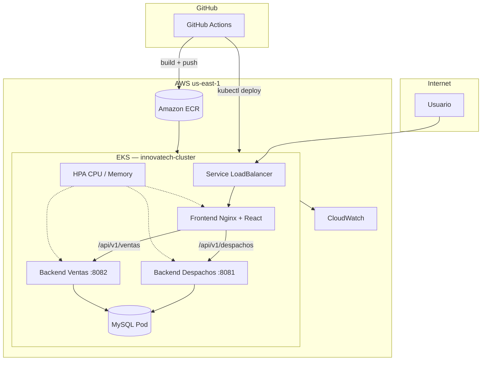

# Innovatech Chile — EP3 DevOps

> Orquestación en **AWS EKS**, despliegue automatizado con **GitHub Actions** y microservicios containerizados en **Amazon ECR**.

| | |
|---|---|
| **Repositorio** | [github.com/IgnacioLondono/proyecto-innovatech](https://github.com/IgnacioLondono/proyecto-innovatech) |
| **Asignatura** | ISY1101 — Introducción a Herramientas DevOps |
| **Evaluación** | Parcial N°3 (Encargo + Presentación) |
| **Integrantes** | Thomas Ferra · Gonzalo Viveros · Ignacio Londoño |
| **Región AWS** | `us-east-1` |
| **Última actualización** | Junio 2026 |

---

## Tabla de contenidos

1. [Contexto](#contexto)
2. [Equipo y responsabilidades](#equipo-y-responsabilidades)
3. [Arquitectura](#arquitectura)
4. [Estructura del repositorio](#estructura-del-repositorio)
5. [Stack tecnológico](#stack-tecnológico)
6. [Requisitos previos](#requisitos-previos)
7. [Configuración inicial](#configuración-inicial)
8. [Despliegue en EKS](#despliegue-en-eks)
9. [Pipeline CI/CD](#pipeline-cicd)
10. [Autoscaling (HPA)](#autoscaling-hpa)
11. [Monitoreo y validación](#monitoreo-y-validación)
12. [Seguridad](#seguridad)
13. [Solución de problemas](#solución-de-problemas)
14. [Checklist pre-presentación](#checklist-pre-presentación)
15. [Referencias](#referencias)

---

## Contexto

Innovatech Chile completó la contenedorización (EP2) y la infraestructura base en AWS (EP1). En esta entrega el equipo despliega la aplicación de **Despachos y Ventas** sobre un clúster **EKS**, con:

- Imágenes privadas en **ECR**
- Exposición pública del frontend vía **LoadBalancer**
- Comunicación interna Front → Back mediante **Nginx reverse proxy**
- Escalado horizontal con **HPA**
- Liberación continua con **GitHub Actions** (build → push → deploy)

### Objetivos del encargo

| Indicador | Descripción | Estado |
|-----------|-------------|--------|
| IE1 | Clúster EKS funcional (VPC, IAM, nodos) | Implementado |
| IE2 | Front + Back desplegados desde ECR | Implementado |
| IE3 | Autoscaling con métricas y justificación | Implementado |
| IE4 | Pipeline CI/CD automatizado | Implementado |
| IE5 | Gestión segura de secrets | Implementado |
| IE6 | Análisis de logs, tiempos y métricas | Documentado |
| IE7 | Validación Front → Back operativa | Script incluido |

---

## Equipo y responsabilidades

| Integrante | Rol principal |
|------------|---------------|
| **Thomas Ferra** | Arquitectura EKS, manifiestos Kubernetes, networking y HPA |
| **Gonzalo Viveros** | Pipelines GitHub Actions, integración ECR y despliegue automatizado |
| **Ignacio Londoño** | Dockerización, configuración Nginx, secrets y validación funcional |

---

## Arquitectura



### Servicios desplegados

| Servicio | Deployment | Puerto | Réplicas | Exposición |
|----------|------------|--------|----------|------------|
| Frontend | `frontend-despacho` | 80 | 2 (HPA 2–5) | LoadBalancer público |
| Despachos API | `despachos-api` | 8081 | 2 (HPA 2–5) | ClusterIP interno |
| Ventas API | `ventas-api` | 8082 | 2 (HPA 2–5) | ClusterIP interno |
| MySQL | `mysql-deployment` | 3306 | 1 | Solo red interna |

El frontend enruta las peticiones API a través de `nginx.conf`:

- `/api/v1/despachos` → `despachos-service:8081`
- `/api/v1/ventas` → `ventas-service:8082`

---

## Estructura del repositorio

```
proyecto-innovatech/
├── front_despacho/              # React + Vite + Nginx
├── back-Despachos_SpringBoot/   # API REST Despachos (8081)
├── back-Ventas_SpringBoot/      # API REST Ventas (8082)
├── k8s/
│   ├── mysql-k8s.yaml           # MySQL + PVC + Service
│   ├── mysql-secret.example.yaml
│   ├── backends-k8s.yaml        # Deployments y Services backend
│   ├── frontend-k8s.yaml        # Frontend + LoadBalancer
│   └── hpa-config.yaml          # Horizontal Pod Autoscaler
├── .github/workflows/
│   ├── deploy-k8s.yaml          # Manifiestos + HPA
│   ├── deploy-front.yaml
│   ├── deploy-despachos.yaml
│   └── deploy-ventas.yaml
├── scripts/
│   ├── setup-eks.sh             # Setup completo del clúster
│   ├── verify-cluster.sh        # Validación Front → Back
│   └── load-test.sh             # Simulación de carga para HPA
└── docker-compose.yml           # Entorno local de desarrollo
```

---

## Stack tecnológico

| Capa | Tecnología |
|------|------------|
| Frontend | React, Vite, Tailwind CSS, Nginx |
| Backend | Spring Boot 3, Java 17, MySQL |
| Contenedores | Docker multi-stage builds |
| Orquestación | Amazon EKS (Kubernetes 1.28+) |
| Registry | Amazon ECR |
| CI/CD | GitHub Actions |
| Observabilidad | CloudWatch, `kubectl logs`, metrics-server |

---

## Requisitos previos

- Cuenta **AWS Academy** con Learner Lab activo
- [AWS CLI](https://aws.amazon.com/cli/) configurado
- [kubectl](https://kubernetes.io/docs/tasks/tools/)
- [Docker Desktop](https://www.docker.com/products/docker-desktop/)
- [Git](https://git-scm.com/)
- Bash (Git Bash o WSL en Windows)

```bash
aws --version
kubectl version --client
docker --version
git --version
```

---

## Configuración inicial

### 1. Clonar el repositorio

```bash
git clone https://github.com/IgnacioLondono/proyecto-innovatech.git
cd proyecto-innovatech
```

### 2. Conectar al clúster EKS

```bash
aws eks update-kubeconfig \
  --region us-east-1 \
  --name innovatech-cluster

kubectl get nodes
```

### 3. Secrets en GitHub Actions

Configurar en **Settings → Secrets and variables → Actions**:

| Secret | Descripción |
|--------|-------------|
| `AWS_ACCESS_KEY_ID` | Credencial temporal del Learner Lab |
| `AWS_SECRET_ACCESS_KEY` | Credencial temporal del Learner Lab |
| `AWS_SESSION_TOKEN` | Token de sesión del lab |
| `AWS_REGION` | `us-east-1` |
| `EKS_CLUSTER_NAME` | `innovatech-cluster` |
| `ECR_REGISTRY` | URI base del registry ECR |
| `ECR_REPO_URL_FRONTEND` | URL completa repo frontend |
| `ECR_REPO_URL_BACKEND` | URL completa repo backend |
| `MYSQL_ROOT_PASSWORD` | Password root MySQL |
| `MYSQL_USER` | Usuario MySQL |
| `MYSQL_PASSWORD` | Password MySQL |

> Las credenciales **no** van en el código. Usar `k8s/mysql-secret.example.yaml` como plantilla.

### 4. Secret MySQL en Kubernetes

```bash
cp k8s/mysql-secret.example.yaml k8s/mysql-secret.yaml
# Editar valores en mysql-secret.yaml (archivo ignorado por git)
kubectl apply -f k8s/mysql-secret.yaml
```

---

## Despliegue en EKS

### Opción A — Script automatizado (recomendado)

```bash
export AWS_REGION=us-east-1
export EKS_CLUSTER_NAME=innovatech-cluster

bash scripts/setup-eks.sh
bash scripts/verify-cluster.sh
```

### Opción B — Manual

```bash
# Metrics-server (requerido para HPA)
kubectl apply -f https://github.com/kubernetes-sigs/metrics-server/releases/latest/download/components.yaml
kubectl patch deployment metrics-server -n kube-system --type='json' \
  -p='[{"op":"add","path":"/spec/template/spec/containers/0/args/-","value":"--kubelet-insecure-tls"}]'

# Despliegue por capas
kubectl apply -f k8s/mysql-k8s.yaml
sleep 15
kubectl apply -f k8s/backends-k8s.yaml
sleep 15
kubectl apply -f k8s/frontend-k8s.yaml
kubectl apply -f k8s/hpa-config.yaml

kubectl get pods -w
```

### Obtener URL pública

```bash
kubectl get svc frontend-service

# Probar endpoints
curl http://<LOAD-BALANCER-URL>/
curl http://<LOAD-BALANCER-URL>/api/v1/despachos
curl http://<LOAD-BALANCER-URL>/api/v1/ventas
```

---

## Pipeline CI/CD

Cada push a la rama `deploy` dispara el workflow correspondiente según la carpeta modificada.

```
Push a rama deploy
       │
       ▼
  GitHub Actions
       │
       ├── Checkout
       ├── AWS credentials
       ├── Login ECR
       ├── docker build
       ├── docker push
       └── kubectl set image + rollout status
```

| Workflow | Trigger (`paths`) | Acción |
|----------|-------------------|--------|
| `deploy-k8s.yaml` | `k8s/**` | Aplica manifiestos y HPA |
| `deploy-front.yaml` | `front_despacho/**` | Build + deploy frontend |
| `deploy-despachos.yaml` | `back-Despachos_SpringBoot/**` | Build + deploy despachos |
| `deploy-ventas.yaml` | `back-Ventas_SpringBoot/**` | Build + deploy ventas |

### Ejemplo: desplegar un cambio en backend

```bash
git add back-Despachos_SpringBoot/
git commit -m "feat: agregar validación en creación de despachos"
git push origin deploy
```

Verificar en GitHub Actions y luego:

```bash
kubectl rollout status deployment/despachos-api
kubectl logs deployment/despachos-api --tail=30
```

---

## Autoscaling (HPA)

Archivo: `k8s/hpa-config.yaml`

| Parámetro | Valor | Justificación |
|-----------|-------|---------------|
| `minReplicas` | 2 | Alta disponibilidad ante fallo de un pod |
| `maxReplicas` | 5 | Límite de costo en Learner Lab |
| CPU target | 70% | Escala antes de saturación total |
| Memory target | 80% | Margen contra OOMKill |

```bash
kubectl apply -f k8s/hpa-config.yaml
kubectl get hpa -w

# Evidencia de escalado para la presentación
bash scripts/load-test.sh
# bash scripts/load-test.sh http://<URL> 1000 50
```

---

## Monitoreo y validación

### Logs

```bash
kubectl logs -f deployment/frontend-despacho
kubectl logs -f deployment/despachos-api
kubectl logs -f deployment/ventas-api
kubectl logs -f deployment/mysql-deployment
```

### Métricas

```bash
kubectl top nodes
kubectl top pods
kubectl get hpa
```

### Validación automática

```bash
bash scripts/verify-cluster.sh
```

Verifica nodos, pods, frontend público y respuesta de `/api/v1/despachos` y `/api/v1/ventas`.

---

## Seguridad

- Credenciales MySQL en **Kubernetes Secrets** (no en el repositorio)
- Credenciales AWS en **GitHub Secrets** cifradas
- Backends expuestos solo en red interna del clúster
- Frontend como único punto de entrada público
- IAM con principio de mínimo privilegio
- Plantilla de secret en `k8s/mysql-secret.example.yaml`; el archivo real está en `.gitignore`

---

## Solución de problemas

### Pods en `CrashLoopBackOff`

```bash
kubectl logs deployment/despachos-api --previous
kubectl get secret mysql-secret -o yaml
```

Recrear el secret si las credenciales son incorrectas.

### Frontend no conecta con backends

Verificar que `front_despacho/nginx.conf` apunte a los servicios internos:

```nginx
proxy_pass http://despachos-service:8081;
proxy_pass http://ventas-service:8082;
```

### HPA sin métricas

Confirmar que metrics-server está instalado y los deployments tienen `resources.requests` definidos.

```bash
kubectl get deployment metrics-server -n kube-system
kubectl describe hpa despachos-api-hpa
```

### Pipeline falla en deploy

- Renovar credenciales del Learner Lab en GitHub Secrets
- Verificar que `EKS_CLUSTER_NAME` coincide con el clúster activo
- Revisar logs del workflow en la pestaña Actions

---

## Checklist pre-presentación

- [ ] `kubectl get nodes` — nodos en estado `Ready`
- [ ] `kubectl get pods` — todos en `Running`
- [ ] Frontend accesible por URL pública
- [ ] `/api/v1/despachos` y `/api/v1/ventas` responden HTTP 200
- [ ] `kubectl get hpa` — HPA activo
- [ ] `bash scripts/load-test.sh` — evidencia de escalado
- [ ] GitHub Actions en verde tras un push a `deploy`  
      → [Ver Actions](https://github.com/IgnacioLondono/proyecto-innovatech/actions)
- [ ] Logs disponibles con `kubectl logs`
- [ ] Commits con mensajes descriptivos (`git log --oneline`)

---

## Referencias

- [Documentación AWS EKS](https://docs.aws.amazon.com/eks/)
- [Kubernetes Docs](https://kubernetes.io/docs/)
- [GitHub Actions](https://docs.github.com/en/actions)
- [Docker — Best practices](https://docs.docker.com/develop/dev-best-practices/)
- [Metrics Server](https://github.com/kubernetes-sigs/metrics-server)

---

<p align="center">
  <strong>Innovatech Chile</strong> · EP3 · ISY1101 · 2026<br>
  Thomas Ferra · Gonzalo Viveros · Ignacio Londoño<br>
  <a href="https://github.com/IgnacioLondono/proyecto-innovatech">IgnacioLondono/proyecto-innovatech</a>
</p>
